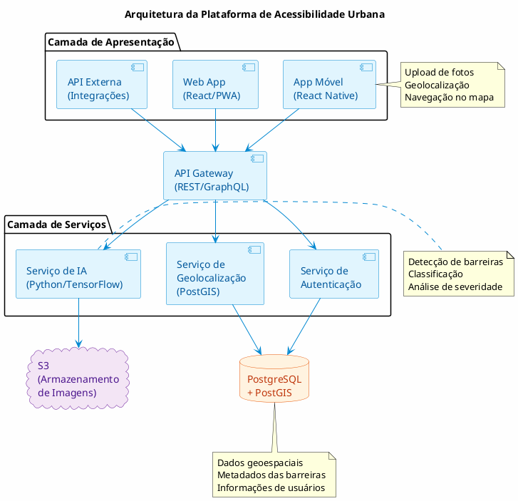

# Documento de Especificação do Projeto: Plataforma de Acessibilidade Urbana com IA

## Autores
* Felipe Gasparino
* Gustavo Nascimento
* Tiago Teraoka
* Thomaz Scopel
* Vinícius Cappatti

## 1. DEFINIÇÃO DO PROBLEMA

### 1.1 Contexto

As cidades brasileiras enfrentam graves deficiências em acessibilidade urbana, impactando diretamente a qualidade de vida de pessoas com mobilidade reduzida, idosos, usuários de cadeiras de rodas, pessoas com deficiência visual e famílias com carrinhos de bebê.

### 1.2 Problemas Identificados

- **Falta de dados estruturados**: Inexistência de base de dados centralizada e atualizada sobre barreiras de acessibilidade
- **Informações fragmentadas**: Denúncias dispersas em redes sociais e canais isolados sem sistematização
- **Ausência de priorização técnica**: Gestores públicos tomam decisões sem dados concretos sobre impacto e urgência
- **Invisibilidade do problema**: Barreiras não documentadas perpetuam exclusão social
- **Alto custo de mapeamento manual**: Levantamentos tradicionais demandam recursos humanos e tempo excessivos

### 1.3 Impacto do Problema

- 17,2 milhões de brasileiros com dificuldade de locomoção (IBGE 2019)
- Perda de autonomia e dignidade para população vulnerável
- Má alocação de recursos públicos em intervenções não prioritárias
- Descumprimento de legislação de acessibilidade (Lei 13.146/2015)

## 2. DESCRIÇÃO DA SOLUÇÃO

### 2.1 Proposta de Valor
Plataforma open-source que utiliza tecnologias acessíveis para criar um mapa colaborativo e inteligente de barreiras de acessibilidade urbana, transformando dados enviados por cidadãos em dados estruturados e acionáveis para gestão pública.

### 2.2 Componentes Principais

1. **Sistema de Coleta Colaborativa**
   - Sistema de report de problemas

2. **Plataforma de Dados Abertos**
   - Mapa interativo e pesquisável

4. **Painel de Gestão**
   - Dashboard analítico para gestores e sociedade civil

### 2.3 Diagrama de caso de uso

## 3. ESPECIFICAÇÕES TÉCNICAS

### 3.1 Arquitetura do Sistema

### 3.2 Stack Tecnológico Proposto
- **Backend**: Node.js (NestJS)
- **Banco de Dados**: PostgreSQL com PostGIS
- **Armazenamento**: S3 ou compatível
- **Frontend**: React + Next.js
- **Infraestrutura**: Docker + Kubernetes

### 3.3 Categorias de Barreiras Detectáveis

1. **Infraestrutura Física**
   - Escadas sem alternativa acessível
   - Rampas fora de norma (>8,33% inclinação)
   - Calçadas danificadas ou estreitas (<1,20m)
   - Desníveis e buracos

2. **Sinalização e Orientação**
   - Ausência de piso tátil
   - Falta de sinalização visual/sonora
   - Semáforos sem recurso sonoro

3. **Obstáculos**
   - Mobiliário urbano mal posicionado
   - Veículos estacionados irregularmente
   - Obras sem passagem alternativa
   - Comércio informal obstruindo passagem

## 5. IMPLEMENTAÇÃO

### 4.1 Fases do Projeto

**Fase 1 - MVP**
- App básico de captura de fotos
- Detecção de 3 tipos principais de barreiras
- Mapa web simples
- API básica

**Fase 2 - Validação**
- Piloto com 1 cidade parceira
- Ajuste dos modelos de IA com dados reais
- Interface para validação humana
- Métricas de acurácia

**Fase 3 - Expansão**
- Dashboard completo para gestores
- Detecção de 10+ tipos de barreiras
- Sistema de priorização automática
- Integrações com sistemas municipais

**Fase 4 - Escala**
- Expansão para múltiplas cidades
- Recursos de engajamento e gamificação
- Evolução contínua da plataforma e dos modelos

### 5.2 Métricas de Sucesso
- **Técnicas**: Acurácia >85% na detecção, <5% falsos positivos
- **Engajamento**: 1000+ usuários ativos/mês por cidade
- **Impacto**: 30% das barreiras reportadas resolvidas em 6 meses
- **Negócio**: 1-2 bairros em uso

## 6. GOVERNANÇA E SUSTENTABILIDADE

### 6.1 Modelo Open Source
- Licença MIT para código base
- Documentação completa e atualizada
- Processo transparente de contribuição
- Datasets públicos, respeitando a privacidade dos cidadãos

### 5.2 Parcerias Estratégicas

- Universidades para pesquisa e desenvolvimento
- Organizações de direitos das pessoas com deficiência
- Órgãos públicos municipais e estaduais
- Empresas e entidades de tecnologia assistiva

### 5.3 Conformidade e Ética

- Conformidade com a LGPD: Anonimização automática dos dados pessoais
- Transparência nos algoritmos
- Conselho consultivo incluindo representantes de pessoas com deficiência
- Auditorias periódicas para evitar vieses e promover justiça algorítmica

## 6. RISCOS E MITIGAÇÕES

| Risco | Probabilidade | Impacto | Mitigação |
|-------|--------------|---------|-----------|
| Baixa adoção inicial | Alta | Alto | Parcerias com lideranças PcD e campanhas locais |
| Viés nos modelos de IA | Média | Alto | Dataset diversificado e validação contínua |
| Sustentabilidade do projeto | Média | Alto | Engajamento da sociedade e busca de apoios institucionais |
| Questões de privacidade | Baixa | Alto | Anonimização, blur automático e políticas claras de dados |
| Resistência política | Média | Médio | Argumentação baseada em impactos sociais e legais |

## 7. PRÓXIMOS PASSOS

1. Formar equipe voluntária e definir a stack tecnológica final
2. Desenvolver prova de conceito técnica
3. Buscar cidade parceira para projeto piloto
4. Lançar MVP e iniciar coleta de feedback da comunidade
5. Iterar com base em dados reais e expandir funcionalidades

---

*Este documento é um trabalho em progresso e será atualizado conforme o projeto evolui. Contribuições e feedback são bem-vindos através do repositório do projeto.*
